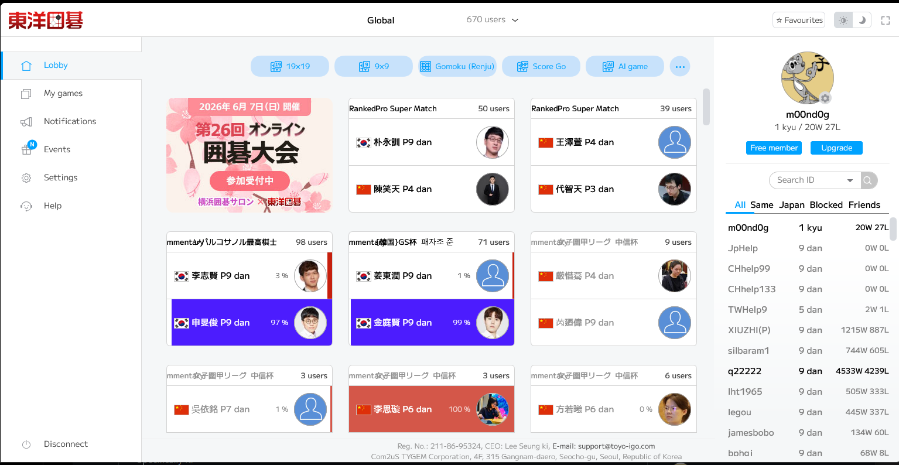
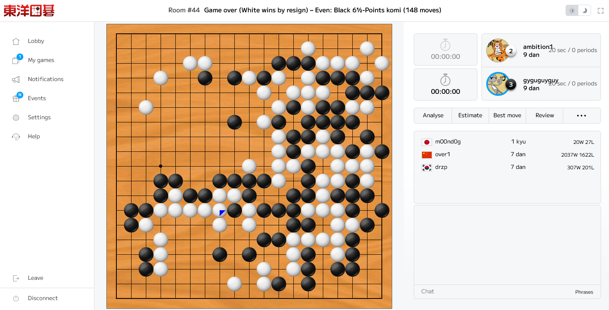
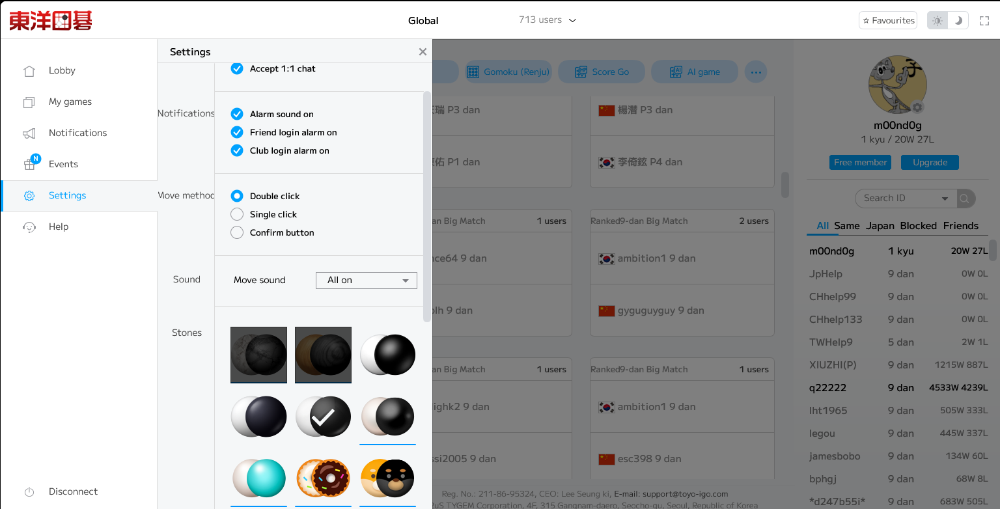

# Toyo-igo-Tygem-JP-English-UI

A Tampermonkey userscript that translates the Japanese UI of [Toyo-igo](http://www.toyo-igo.com/) (the Japanese web client for Tygem Go) into English.

## Screenshots

**Lobby**

**In game**

**Settings**

## What it does

Toyo-igo is a canvas-rendered single-page application that loads all its UI text from a set of server-side XML and JSON files. Standard DOM-based translation approaches don't work here — the script instead intercepts network requests at the browser level and patches the data before the app reads it.

Specifically it:

- Intercepts the `lang.xml` request (1,000+ UI string key/value pairs) and replaces Japanese strings with English translations before the app parses it
- Patches `G_VAR.SERVER_JP` directly after `config.js` executes to translate server names
- Intercepts `gibo_load_user_file.php` responses via the Fetch API to translate game record type and handicap fields
- Removes the banner ad on page load

## Coverage

Most of the UI is translated, including the lobby, game rooms, menus, settings, notifications, game analysis tools, match request dialogs, win/loss results, player info panels, game records, and error messages.

Some text remains in Japanese where it is either hardcoded into image sprite sheets (e.g. some promotional banners) or rendered directly onto the canvas without going through the string lookup system.

## Requirements

- [Tampermonkey](https://www.tampermonkey.net/) browser extension (Firefox or Chrome)

## Installation

1. Install the [Tampermonkey](https://www.tampermonkey.net/) extension for your browser
2. Click on the userscript file in this repo and then click **Raw**
3. Tampermonkey should prompt you to install it automatically — click **Install**
4. Navigate to [http://www.toyo-igo.com/](http://www.toyo-igo.com/) and the UI will be in English

## Notes

- The script runs at `document-start` so it is in place before any page code executes
- The translation patches `responseXML` as well as `responseText` since the app's resource loader (PxLoader) reads the XML DOM directly
- Server names are patched by polling for `G_VAR` after `config.js` has executed as a script tag, since that file cannot be intercepted via XHR or Fetch
- Game record fields are patched via a Fetch interceptor since that endpoint uses the Fetch API rather than XHR

## License

MIT
